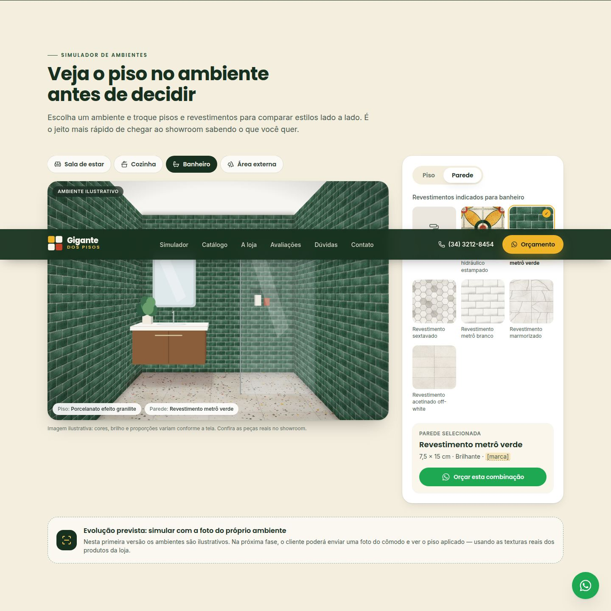
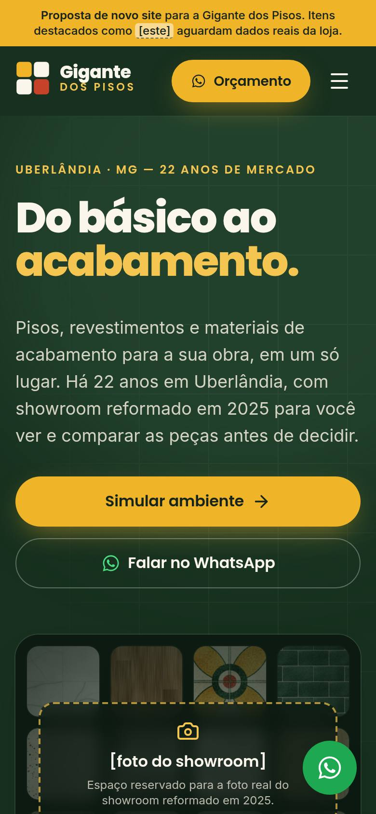

# Gigante dos Pisos — novo site (proposta)

Site institucional e comercial da **Gigante dos Pisos**, loja de pisos,
revestimentos e materiais de construção e acabamento em **Uberlândia (MG)**,
com 22 anos de mercado. Este projeto é uma **apresentação para os donos da
empresa**: usa apenas os dados reais confirmados e deixa todo o resto como
placeholder visível entre `[colchetes]`.

> **Regra de conteúdo:** nada de depoimentos, números, prêmios, certificações
> ou fotos inventados. Fotos só da loja (ou placeholders identificados), nunca
> de banco de imagens apresentadas como se fossem da loja.

| Desktop | Simulador | Mobile |
| --- | --- | --- |
|  |  |  |

Sistema de design: [docs/DESIGN-SYSTEM.md](docs/DESIGN-SYSTEM.md) ·
[captura da página /design-system](docs/screenshots/design-system.jpg).

## Stack

- **Next.js 16** (App Router, Turbopack) + **React 19** + **TypeScript**
- **Tailwind CSS v4** (tokens no `@theme` de `src/app/globals.css`)
- **Framer Motion** (pacote `motion`, carregado sob demanda com `LazyMotion`)
- `next/font` (Poppins + Inter auto-hospedadas), `next/image`, `lucide-react`
- Sem back-end: contato via WhatsApp; avaliações do Google opcionais via API

## Rodando localmente

Requer Node.js 20.9+ (recomendado 22).

```bash
npm install
npm run dev        # http://localhost:3000
npm run build      # build de produção
npm run start      # serve o build
npm run lint       # ESLint
npm run typecheck  # TypeScript
npm run textures   # regenera as texturas ilustrativas (public/texturas)
```

Páginas: `/` (site) e `/design-system` (guia visual vivo, não indexado).

## Seções

1. **Hero** — "Do básico ao acabamento", 22 anos de Uberlândia, CTA duplo
   (Simular ambiente / Falar no WhatsApp), nota 4,8★ e Instagram. A imagem é o
   placeholder `[foto do showroom]` até a loja enviar a foto real.
2. **Simulador de ambientes** — sala, cozinha, banheiro e área externa; troca de
   piso e de parede com transição suave; orçamento da combinação pelo WhatsApp.
3. **Catálogo filtrável** — categoria, ambiente e faixa de preço; hover com zoom
   e troca de imagem (material aplicado); estado vazio e "Carregar mais".
   Cada card pode abrir o produto direto no simulador.
4. **A loja (diferenciais)** — contadores animados (22 anos, 23,1 mil
   seguidores, 4,8★), do básico ao acabamento, entrega, instalação, showroom.
5. **Prova social** — nota e total do Google; avaliações reais via integração
   (ou placeholders); galeria de obras entregues (placeholders).
6. **Dúvidas (FAQ)** — entrega, instalação, pagamento, prazos etc., em acordeão.
7. **Contato e rodapé** — telefone, WhatsApp, endereço, horário, mapa, Instagram
   e formulário que abre o WhatsApp com a mensagem pronta; botão flutuante de
   WhatsApp sempre visível.

## Onde editar o conteúdo

| O quê | Arquivo |
| --- | --- |
| Dados da loja (telefone, WhatsApp, endereço, horário, redes, fotos, modo proposta) | `src/content/site.ts` |
| Produtos do catálogo/simulador | `src/content/products.ts` |
| Perguntas frequentes | `src/content/faq.ts` |
| Texturas (tamanho em cm, cores, arquivo real) | `src/content/textures.json` |
| Cores, fontes, escala tipográfica | `src/app/globals.css` (`@theme`) |

Placeholders: em qualquer texto, escreva o trecho pendente entre colchetes —
ele aparece destacado no site. Quando o dado real chegar, é só trocar o texto.

## Checklist: dados a confirmar com a loja

Dados **reais** já usados: nome, segmento ("do básico ao acabamento"),
Uberlândia/MG, telefone (34) 3212-8454, Instagram @gigantedospisoss (~23,1 mil
seguidores), 22 anos, 4,8★ com ~1.280 avaliações no Google, showroom reformado
em 2025 e a paleta verde/amarelo/vermelho.

Pendentes (aparecem como `[placeholder]` no site):

- [ ] **Número de WhatsApp** — hoje o link usa o telefone fixo provisoriamente
      (`site.whatsapp.number`); confirmar se é WhatsApp Business.
- [ ] **Endereço completo e CEP**, e o pino/embed oficial do Google Maps.
- [ ] **Horário de funcionamento** (semana, sábado, domingo/feriados).
- [ ] **Logotipo oficial e arte do mascote** (`site.images.logo` / `.mascot`) —
      a marca atual do site é provisória.
- [ ] **Foto real do showroom** (`site.images.showroom`) para o hero.
- [ ] **Fotos de obras entregues** (com autorização dos clientes).
- [ ] **Avaliações do Google** — ativar a integração (abaixo) ou colar textos
      reais fornecidos pela loja, sem edição.
- [ ] **Entrega:** área atendida, prazos e cálculo do frete.
- [ ] **Instalação:** equipe própria ou parceiros; como é orçada.
- [ ] **Formas de pagamento** e parcelamento.
- [ ] **Política de troca e devolução.**
- [ ] **Catálogo real:** produtos, marcas, formatos, fotos/texturas e preços
      (ou faixas de preço) — os itens atuais são **demonstrativos**.
- [ ] **Razão social e CNPJ** (rodapé).
- [ ] Outras redes sociais oficiais, se houver (`site.otherSocials`).

## Simulador de ambientes — como funciona

- Os ambientes são **ilustrações vetoriais** (não fotos), montadas com uma
  câmera em perspectiva (`src/components/simulator/geometry.ts` e `rooms.ts`).
- Piso e paredes são camadas com a textura repetida **em escala real (cm)**,
  projetadas com uma homografia (`matrix3d`) — o navegador faz o mapeamento em
  perspectiva na GPU. Por isso a mesma técnica aceita **fotos reais de
  texturas**: basta informar `src` e `size` no `textures.json`.
- Trocas de material e de ambiente usam crossfade (Framer Motion).

**Evolução sugerida:** (1) trocar as texturas ilustrativas pelas texturas
reais dos fornecedores; (2) usar renders/fotos reais dos ambientes com máscara
de piso/parede; (3) permitir que o cliente envie a foto do próprio cômodo
(marcação dos 4 cantos do piso + a mesma homografia, ou segmentação por IA).

## Avaliações do Google (opcional)

1. No Google Cloud, ative a **Places API (New)** e crie uma chave restrita a ela.
2. Descubra o **Place ID** da ficha da loja (ferramenta "Place ID Finder").
3. Configure as variáveis `GOOGLE_PLACES_API_KEY` e `GOOGLE_PLACE_ID`
   (veja `.env.example`).

O site passa a exibir a nota, o total e até 3 avaliações públicas, com autor e
link de origem, revalidando uma vez por dia (`src/lib/google-reviews.ts`). Sem as
variáveis, usa os números fixos e os placeholders. A API é paga por uso (há cota
gratuita mensal) — confira os termos de exibição do Google.

## Deploy

Antes de publicar oficialmente, em `src/content/site.ts`:

- `pitchMode: false` — remove a faixa "proposta" e libera a indexação
  (em modo proposta a página é `noindex` e o `robots.txt` bloqueia tudo);
- preencha os dados pendentes e confira `NEXT_PUBLIC_SITE_URL`.

### Vercel (recomendado)

1. Suba o repositório no GitHub.
2. Em [vercel.com/new](https://vercel.com/new), importe o repositório — o
   framework Next.js é detectado sozinho (build `next build`).
3. Em *Settings → Environment Variables*, adicione `NEXT_PUBLIC_SITE_URL` e,
   se quiser, as variáveis do Google.
4. Em *Settings → Domains*, aponte `gigantedospisos.com.br` (registros DNS
   indicados pela Vercel).

### Netlify

1. Em *Add new site → Import an existing project*, escolha o repositório.
2. O `netlify.toml` já define `npm run build`, pasta `.next` e Node 22; o runtime
   de Next.js da Netlify é instalado automaticamente.
3. Configure as mesmas variáveis em *Site configuration → Environment variables*.
4. Em *Domain management*, adicione o domínio próprio.

Todas as páginas são geradas estaticamente; com a integração do Google ativa,
a página inicial é revalidada a cada 24 h (ISR), suportado nas duas plataformas.

## Performance e acessibilidade

- Página 100% estática; JavaScript de animação carregado sob demanda.
- Hero sem imagem pesada enquanto não houver foto (LCP = texto); com a foto,
  `next/image` com `priority` e `sizes`.
- Fontes com `next/font` (sem requisição externa em runtime, sem CLS).
- Scroll reveal por CSS + `IntersectionObserver`: sem JavaScript, ou com
  `prefers-reduced-motion`, todo o conteúdo fica visível. Em conexões lentas
  / economia de dados ("modo leve") as animações são reduzidas.
- Mapa com `loading="lazy"`; formulário não coleta dados (abre o WhatsApp).
- Navegação por teclado, foco visível, `aria-*` nos controles, textos
  alternativos e região `aria-live` no simulador.

## Estrutura

```
src/
  app/                 layout, página, /design-system, robots, sitemap, ícone
  components/
    sections/          Hero, SimulatorSection, CatalogSection, Highlights,
                       SocialProof, Faq, Contact
    simulator/         geometria, ambientes, cena e interface do simulador
    catalog/           filtros, grade e card de produto
    layout/            Header, Footer, Logo, faixa de proposta, WhatsApp flutuante
    motion/            provider do Framer Motion, crossfade, scroll reveal
    ui/                botões, placeholders, estrelas, contador, ícones
  content/             dados da loja, produtos, FAQ, texturas (JSON)
  lib/                 WhatsApp, texturas, Google Reviews, utilitários
public/texturas        texturas ilustrativas (geradas)
public/ilustracoes     ilustrações genéricas dos acabamentos
scripts/               gerador de texturas
docs/DESIGN-SYSTEM.md  sistema de design
```
